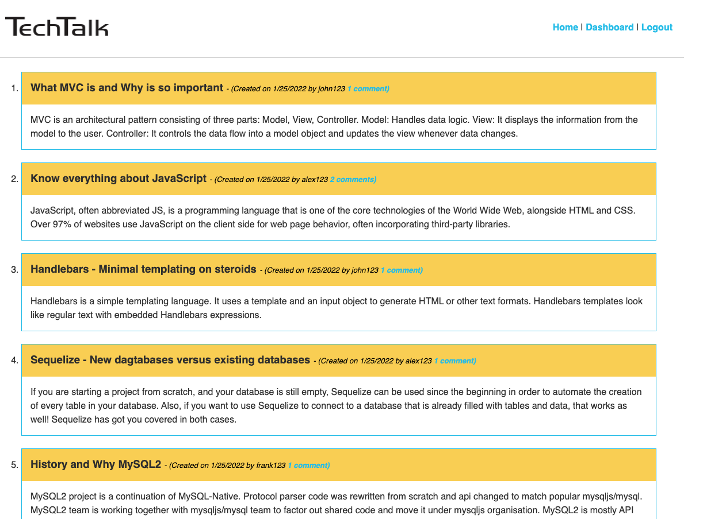
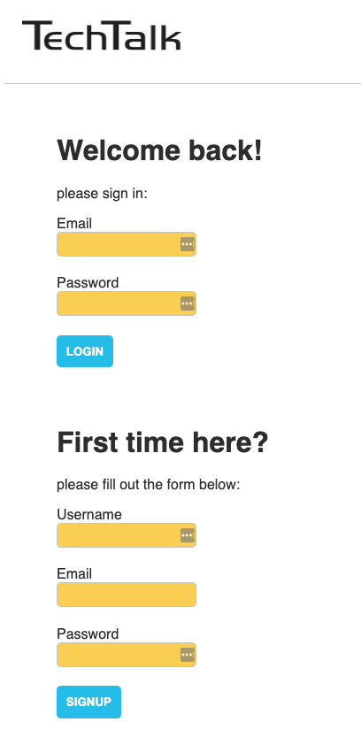
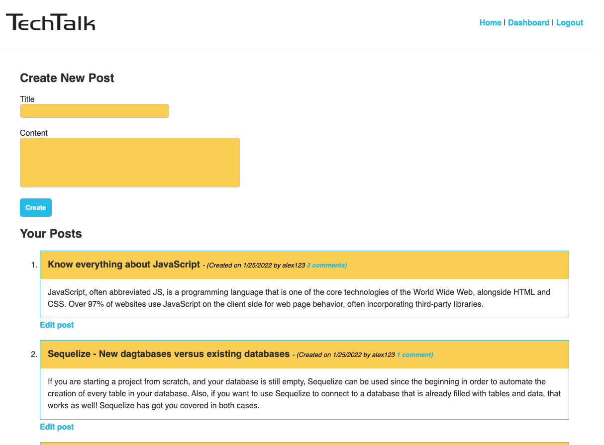
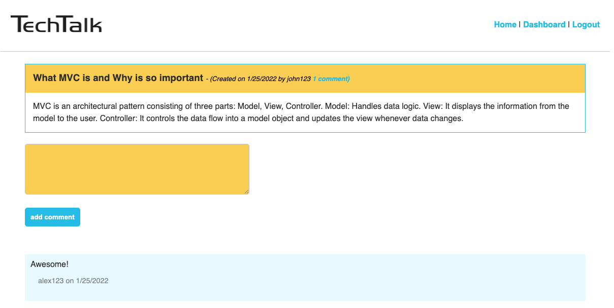
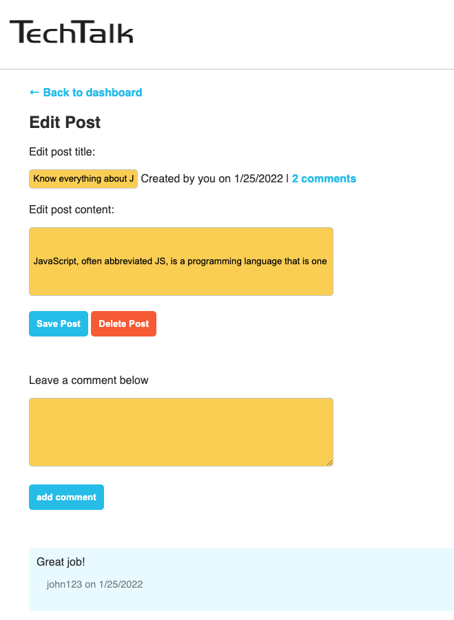

# tech-talk
Fullstack blog app 

## Description 

The task is to build a CMS-style blog site similar to a Wordpress site, where developers can publish their blog posts and comment on other developers’ posts as well. The app will follow the MVC paradigm in its architectural structure, using Handlebars.js as the templating language, Sequelize as the ORM, and the express-session npm package for authentication.

## Table of Contents

* [Usage](#usage)
* [Screenshots](#screenshots)
* [Questions](#questions) 

## Usage 

Writing about tech can be just as important as making it. Developers spend plenty of time creating new applications and debugging existing codebases, but most developers also spend at least some of their time reading and writing about technical concepts, recent advancements, and new technologies. A simple Google search for any concept covered in this course returns thousands of think pieces and tutorials from developers of all skill levels!

## Screenshots

Here are some images showing the app pages:

Homepage

Login & Signup page

User Dashboard

Comment page

Edit & Delete a post

## Questions
If you have any questions about the repo, please send an [email](mailto:andiconner@icloud.com). You can find more of my work at  [my gitub profile page](https://github.com/andiconner)

